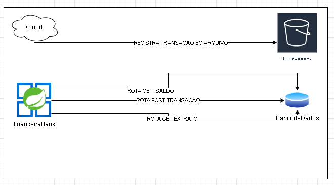
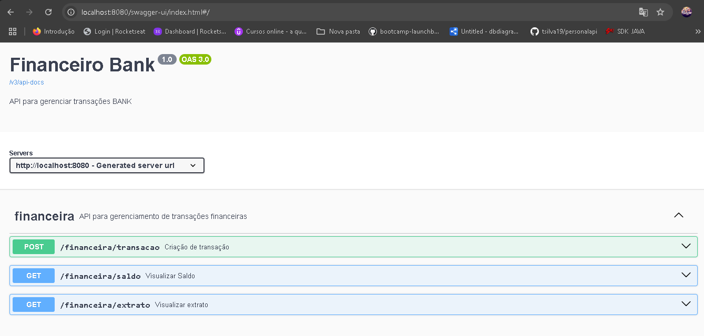

# FinanceiroBank

FinanceiroBank é uma aplicação financeira desenvolvida em Java Spring Boot que permite realizar operações bancárias como saque, depósito, pagamento de boletos, recebimento e envio de PIX, além de exibir o extrato e o saldo da conta.

## Funcionalidades

- **Criar Transação**: Permite criar uma nova transação (depósito, saque, pagamento de boleto, recebimento ou envio de PIX).
- **Obter Extrato**: Retorna o extrato de todas as transações realizadas.
- **Obter Saldo**: Calcula e retorna o saldo atual da conta.

## Tecnologias Utilizadas

- **Java 17**
- **Spring Boot**
- **H2 Database**: Banco de dados em memória para testes.
- **LocalStack**: Simulação de serviços AWS, utilizado para armazenamento de dados no S3.
- **Docker**: Containerização da aplicação.
- **Docker Compose**: Orquestração de containers Docker.
- **AWS CLI**: Utilizado para configurar as credenciais AWS.

## 🏗️ Arquitetura da Aplicação

- A aplicação  possui solicitação de transações bancarias  sendo gravadas em banco de dados  e também como arquivo do bucket s3
- Tendo uma logica sobre o tipo de transação  o saldo é alterado




## 📖 Documentação da API

A API possui uma interface Swagger para facilitar o uso:

🔗 Acesse: [http://localhost:8080/swagger-ui.html](http://localhost:8080/swagger-ui.html)




### Instalação
PRE REQUISITO CONFIGURE O AWS CLI PARA UTILIZAR O LOCALSTACK

1. Clone o repositório:
```
git clone https://github.com/tsilva19/templateFinanceiroBank.git
cd templateFinanceiroBank
```

2. Compile e execute o projeto:


```
./mvnw clean package

docker-compose up --build

```
#### A aplicação estará disponível em http://localhost:8080.

## Endpoints da API
### Cria uma nova transação Deposito ou Saque
1. Deposito `POST /financeira/transacao`:

    - Request Body:
        ```
         {
            "tipo": "DEPOSITO",
            "valor": 100.0,
            "descricao": "Depósito inicial"
         }

        ```

    - Response:
        - 200
        - 500


2. Saque `POST /financeira/transacao`:

    - Request Body:
        ```
         {
           "tipo": "SAQUE",
           "valor": 100.0,
           "descricao": "SAQUE inicial"
         }
        ```

    - Response:
        - 200
        - 500

### Consulta Extrato
1. EXTRATO `GET /financeira/extrato`:
   - Response:
        - 200

           ```
               [
                {
                  "id": 1,
                  "tipo": "DEPOSITO",
                  "valor": 100.0,
                  "dataHora": "2024-06-08T21:18:31.193797",
                  "descricao": "Depósito inicial"
                },
                {
                  "id": 2,
                  "tipo": "DEPOSITO",
                  "valor": 100.0,
                  "dataHora": "2024-06-08T21:19:53.827089",
                  "descricao": "Depósito inicial"
                  },
                {
                  "id": 3,
                  "tipo": "SAQUE",
                  "valor": 100.0,
                  "dataHora": "2024-06-08T21:40:10.662168",
                  "descricao": "SAQUE inicial"
                }
              ]
           ```
### Consulta Saldo
1. EXTRATO `GET financeira/saldo`:
    - Response:
        - 200 OK: 1000.0
